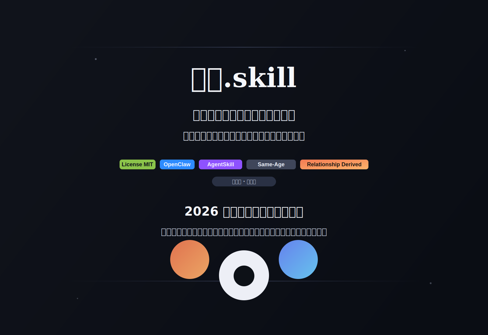
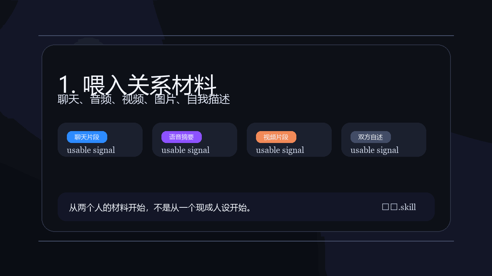

# 后裔.skill



<div align="center">

### 不是生孩子，是先把他聊出来。

如果你们真的有一个孩子，  
他会怎么和你说话？


</div>

---

## 这是什么

`后裔.skill` 是一个给 OpenClaw 用的创作型 persona skill。

它会把两个人的：

- 聊天方式
- 说话语气
- 关系氛围
- 自我描述与互相描述
- 图片、语音、视频里的可用线索

长成一个**虚构的、同龄的、可长期聊天的第三人格**。

不是复制谁。  
不是预测谁。  
不是“算命式孩子模拟器”。

更像是：

`把一段关系，长成一个会说话的人。`

---

## 一眼看完

你提供：

- 代表性聊天片段
- 语音摘要或通话录音
- 图片描述或短视频
- 双方自述 / 互述
- 你想要的偏向，比如更像谁、温柔一点还是更疯一点

它输出：

- `portrait`
- `blend-lab`
- `future-snapshot`
- `session-voice`
- `preset-save`

也就是：

`一个原型 -> 多个变体 -> 场景片段 -> 持续聊天人格 -> 可复用 preset`

---

## 30 秒预览



上面这段 GIF 展示的是最推荐的路径：

`关系材料 -> 媒体抽取 / 证据包 -> 第三人格输出`

---

## 为什么它不像普通的人格蒸馏

普通人格蒸馏，蒸的是一个人。  
`后裔.skill` 蒸的是两个人之间长出来的第三个人。

它关注的不是：

- 谁更像真实本人
- 谁的人设更完整

而是：

- 这两个人相处时，什么会被共同继承
- 什么冲突感会被软化
- 什么梗、语气和情绪节奏会长成新的表达方式

所以它更适合：

- 情侣 / 搭子 / 关系型角色设定
- AI 陪伴和角色扮演用户
- 喜欢做人设混合、关系衍生和角色后代感设定的人

---

## 现在支持的输入

文本输入：

- 聊天记录
- 自我描述
- 对伴侣的描述
- 手写补充说明

媒体输入：

- 图片
- 音频
- 通话录音
- 短视频

如果本地装好了：

- `ffmpeg`
- `whisper`

它还能先把媒体变成一个结构化证据包：

- 视频抽音轨
- 视频抽关键帧
- 音频本地转写
- 输出 `media-evidence-bundle.json`

---

## 快速开始

### 直接安装

Linux / macOS / WSL：

```bash
./scripts/install-skill.sh
python3 ./scripts/smoke-test.py
```

Windows PowerShell：

```powershell
./scripts/install-skill.ps1
python ./scripts/smoke-test.py
```

如果你已经装好了 `ffmpeg` 和 `whisper`，可以继续验证媒体链路：

```bash
python3 ./scripts/smoke-test.py --check-media
```

完整安装说明看：

- [INSTALL.md](./INSTALL.md)
- [templates/openclaw-dual-agent.example.json](./templates/openclaw-dual-agent.example.json)

如果你只想下载成品包，不想直接 clone：

- [Release 下载页](https://github.com/Zhou-xingyu-ts/relationship-descendant-public/releases/tag/v0.1.0)

---

## 推荐运行方式

最稳的方式不是让一个 agent 全干，而是分层：

- `life` 负责接收请求、整理材料、输出最终人格
- `coder` 负责本地脚本、媒体抽取、证据包整理

推荐链路：

1. `life` 收到聊天、图片、音频或视频
2. `coder` 跑 `extract-media-bundle.py`
3. 返回 evidence bundle 和简短摘要
4. `life` 再用 `relationship-descendant` 做人格合成

这样更稳，因为：

- 主聊天 agent 不用直接放开高权限本地执行
- 媒体处理和人格生成可以分开排错
- 公开发布时也更容易解释架构

---

## 示例与 Demo

- [示例 Prompt](./examples.md)
- [演示输入](./demo-input.md)
- [示例输出](./sample-output.md)
- [长版 Demo 输出](./demo-output.md)
- [真实运行版 Demo 输出](./demo-output-live.md)

---

## 边界

这个 skill 是：

- fictional
- creative
- same-age
- relationship-derived

它不是：

- 真实未来孩子预测器
- 心理诊断工具
- 伴侣真实性格还原器
- 现实中某个人的替代品

更完整的边界和数据处理说明看：

- [PRIVACY.md](./PRIVACY.md)
- [SECURITY.md](./SECURITY.md)

---

## 仓库里有什么

- `skill/relationship-descendant`
  - 真正安装和发布用的 skill 本体
- `scripts/`
  - 安装脚本和 smoke test
- `assets/`
  - banner、social preview、demo GIF
- `demo-*.md`
  - 演示输入和输出
